# Experiment 9

## Student Name: Arnav Prajapati 
## UID: 24BAI70131
## Branch: CSE - AIML				
## Section/Group: 24AIT_KRG G1
## Semester: 4						
## Date of Performance: 17/4/26
## Subject Name: DBMS				
## Subject Code: 24CSH-298


## Aim
    To design and implement stored procedures in PostgreSQL for performing Create, Read, Update, and Delete (CRUD) operations on database tables in an efficient and reusable manner.


## Software Requirements
    •	Database Management System:
    o	Oracle Database Express Edition (Oracle XE)
    o	PostgreSQL Database
    •	Database Administration Tool / Client Tool:
    o	Oracle SQL Developer (for Oracle XE)
    o	pgAdmin (for PostgreSQL)


## Objectives
    •	To understand the concept and importance of stored procedures
    •	To implement parameterized stored procedures
    •	To perform INSERT, UPDATE, DELETE, and SEARCH operations
    •	To improve database performance and security
    •	To gain industry-relevant procedural SQL experience


## Theory
    A stored procedure is a precompiled set of SQL statements stored inside the database and executed on demand. Unlike plain SQL queries, stored procedures allow control structures, conditional logic, and reusability, making them highly valuable in enterprise applications.
    In large-scale systems, application logic is often split between the application layer and database layer. Stored procedures reduce network overhead, improve performance, and enhance security by restricting direct table access.
    From a placement perspective, companies such as Oracle, SAP, Amazon, Adobe, Infosys, TCS frequently test candidates on stored procedures to evaluate their understanding of backend logic, transactions, and modular database programming.


## Practical/Experiment Steps
    •	Schema Provisioning: Established the students table with dedicated columns for base data (name, age, department) and a primary key for unique identification. 
    •	Procedure Development: Authored PL/pgSQL stored procedures individually designed to handle each CRUD operation — Insert, Read, Update, and Delete — in a modular and reusable manner. 
    •	INSERT Operation: Implemented a stored procedure to accept student details as parameters and insert a new record into the table dynamically. 
    •	READ Operation: Developed a retrieval procedure using SELECT with a conditional IF FOUND check to fetch and display student records based on a given ID. 
    •	UPDATE Operation: Configured an update procedure to modify existing student records using parameterized inputs, with validation to confirm the target record exists. 
    •	DELETE Operation: Built a deletion procedure with an embedded existence check to safely remove records and notify if the given ID is not found. 
    •	Operational Testing: Executed all procedures using CALL statements with sample data to verify correct insertion, retrieval, modification, and removal of student records from the database.
## Procedure
    •	Accessed the PostgreSQL console and created the students table structure with columns for id, name, age, and department. 
    •	Defined each CRUD stored procedure (insert_student, get_student, update_student, delete_student) using the CREATE OR REPLACE PROCEDURE syntax in PL/pgSQL. 
    •	Integrated INSERT INTO logic within the insert procedure to populate student records dynamically using passed parameters. 
    •	Created the get_student procedure using the SELECT INTO statement along with the FOUND keyword to verify whether a matching record exists before displaying it. 
    •	Executed a successful CALL insert_student(...) test case with valid student data to confirm normal insert operations. 
    •	Ran a SELECT * FROM students query to verify that the inserted records were correctly stored in the table. 
    •	Executed CALL update_student(...) with modified values to confirm that existing records were updated accurately based on the provided id. 
    •	Attempted CALL delete_student(...) with a valid ID to remove the record, followed by a call with an invalid ID to confirm the ELSE branch correctly raised a RAISE NOTICE message stating the student was not found. 
    •	Analysed the final table state using SELECT * FROM students to confirm that only valid records remained and all CRUD operations performed as expected.

## Code
```sql
    -- THIS IS CREATE PROCEDURE --

    CREATE TABLE students(
        id SERIAL PRIMARY KEY,
        name VARCHAR(100),
        age INT,
        department VARCHAR(50)
    );

    -- INSERT OPERATION --
    CREATE OR REPLACE PROCEDURE insert_student(
        p_name VARCHAR,
        p_age INT,
        p_department VARCHAR
    )
    LANGUAGE plpgsql
    AS $$
    BEGIN
        INSERT INTO students(name , age , department)
        VALUES(p_name , p_age,p_department);
        RAISE NOTICE 'Student Inserted Successfully.';
    END;
    $$;

    -- CALLING --
    CALL insert_student('Arnav' , 20 , 'CSE');

    -------------------------------------------------------------------------
    -------------------------------------------------------------------------

    -- READ OPERATION --
    CREATE OR REPLACE PROCEDURE get_student(p_id INT)
    LANGUAGE plpgsql
    AS $$
    DECLARE
        rec students%ROWTYPE;
    BEGIN
        SELECT * INTO rec FROM students WHERE id = p_id;
        IF FOUND THEN
            RAISE NOTICE 'ID: %, Name: %, Age: %, Dept: %',
                rec.id, rec.name, rec.age, rec.department;
        ELSE
            RAISE NOTICE 'Student not found.';
        END IF;
    END;
    $$;

    -- Call
    CALL get_student(1);

    ---------------------------------------------------------------------------
    ---------------------------------------------------------------------------

    -- UPDATE OPERATION --
    CREATE OR REPLACE PROCEDURE update_student(
        p_id INT,
        p_name VARCHAR,
        p_age INT,
        p_department VARCHAR
    )
    LANGUAGE plpgsql
    AS $$
    BEGIN
        UPDATE students
        SET name = p_name,
            age = p_age,
            department = p_department
        WHERE id = p_id;

        IF FOUND THEN
            RAISE NOTICE 'Student updated successfully.';
        ELSE
            RAISE NOTICE 'Student ID not found.';
        END IF;
    END;
    $$;

    -- Call
    CALL update_student(1, 'ARNAV', 21, 'IT');
    ------------------------------------------------------------------------------
    ------------------------------------------------------------------------------


    -- DELETE OPERATION --
    CREATE OR REPLACE PROCEDURE delete_student(p_id INT)
    LANGUAGE plpgsql
    AS $$
    BEGIN
        DELETE FROM students WHERE id = p_id;

        IF FOUND THEN
            RAISE NOTICE 'Student deleted successfully.';
        ELSE
            RAISE NOTICE 'Student ID not found.';
        END IF;
    END;
    $$;

    -- Call
    CALL delete_student(1);

------------------------------------------------------------------------------
------------------------------------------------------------------------------


    -- READ ALL -- 
    CREATE OR REPLACE PROCEDURE get_all_students()
    LANGUAGE plpgsql
    AS $$
    DECLARE
        rec students%ROWTYPE;
    BEGIN
        FOR rec IN SELECT * FROM students LOOP
            RAISE NOTICE 'ID: %, Name: %, Age: %, Dept: %',
                rec.id, rec.name, rec.age, rec.department;
        END LOOP;
    END;
    $$;

    -- Call
    CALL get_all_students();

----------------------------------------------------------------------
----------------------------------------------------------------------

    -- TO VERIFY RESULTS --
    SELECT * FROM students;
```

------------------------------------------------------------------------------------------------------------------------------------------------


## Input/Output Analysis
### SQL Input Queries
### Input a:

    ```sql

    -- THIS IS CREATE PROCEDURE --
    CREATE TABLE students(
        id SERIAL PRIMARY KEY,
        name VARCHAR(100),
        age INT,
        department VARCHAR(50)
    );

    -- INSERT OPERATION --
    CREATE OR REPLACE PROCEDURE insert_student(
        p_name VARCHAR,
        p_age INT,
        p_department VARCHAR
    )
    LANGUAGE plpgsql
    AS $$
    BEGIN
        INSERT INTO students(name, age, department)
        VALUES(p_name, p_age, p_department);
        RAISE NOTICE 'Student Inserted Successfully.';
    END;
    $$;

    -- CALLING --
    CALL insert_student('Arnav', 20, 'CSE');
    ```


Output a.1:
    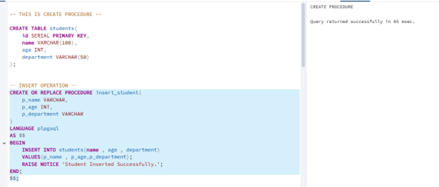
Output a.2
    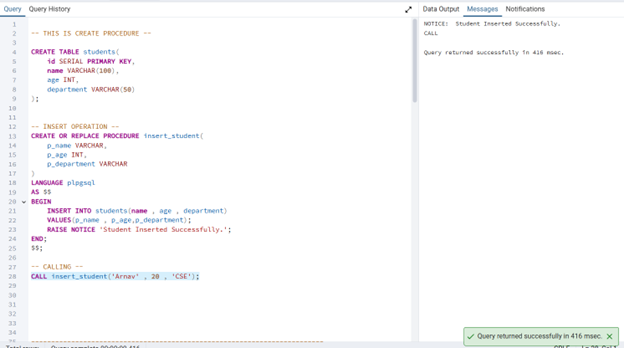


### Input b:
    ```sql
        -- READ OPERATION --
        CREATE OR REPLACE PROCEDURE get_student(p_id INT)
        LANGUAGE plpgsql
        AS $$
        DECLARE
            rec students%ROWTYPE;
        BEGIN
            SELECT * INTO rec FROM students WHERE id = p_id;
            IF FOUND THEN
                RAISE NOTICE 'ID: %, Name: %, Age: %, Dept: %',
                    rec.id, rec.name, rec.age, rec.department;
            ELSE
                RAISE NOTICE 'Student not found.';
            END IF;
        END;
        $$;

        -- Call
        CALL get_student(1);
    ```
Output b.1:
    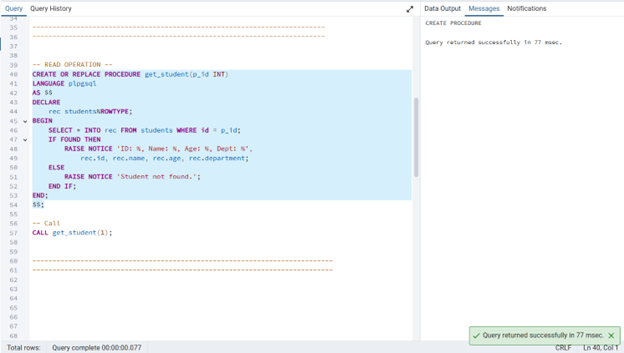
Output b.2:
    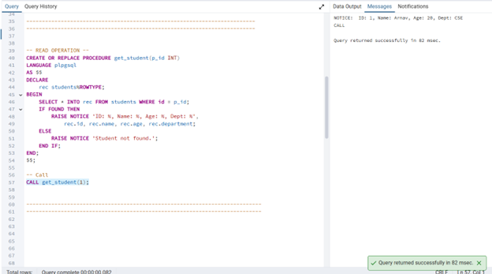


### Input c:
    ```sql
        -- UPDATE OPERATION --
        CREATE OR REPLACE PROCEDURE update_student(
            p_id INT,
            p_name VARCHAR,
            p_age INT,
            p_department VARCHAR
        )
        LANGUAGE plpgsql
        AS $$
        BEGIN
            UPDATE students
            SET name = p_name,
                age = p_age,
                department = p_department
            WHERE id = p_id;

            IF FOUND THEN
                RAISE NOTICE 'Student updated successfully.';
            ELSE
                RAISE NOTICE 'Student ID not found.';
            END IF;
        END;
        $$;

        -- Call
        CALL update_student(1, 'ARNAV', 21, 'IT');
    ```
Output c.1:
    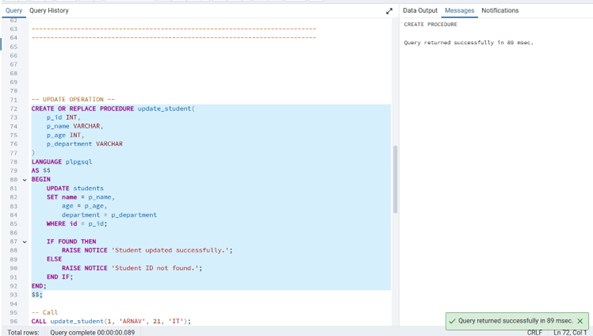
Output c.2:
    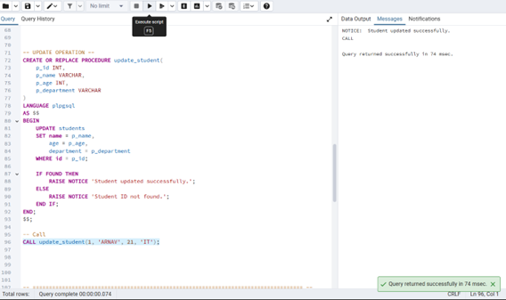
 

### Input d:
    ```sql
        -- DELETE OPERATION --
        CREATE OR REPLACE PROCEDURE delete_student(p_id INT)
        LANGUAGE plpgsql
        AS $$
        BEGIN
            DELETE FROM students WHERE id = p_id;

            IF FOUND THEN
                RAISE NOTICE 'Student deleted successfully.';
            ELSE
                RAISE NOTICE 'Student ID not found.';
            END IF;
        END;
        $$;

        -- Call
        CALL delete_student(1);
    ```
Output d.1:
    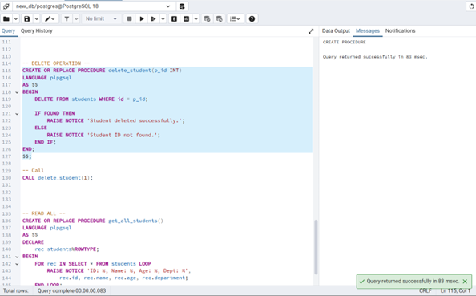
Output d.2:
    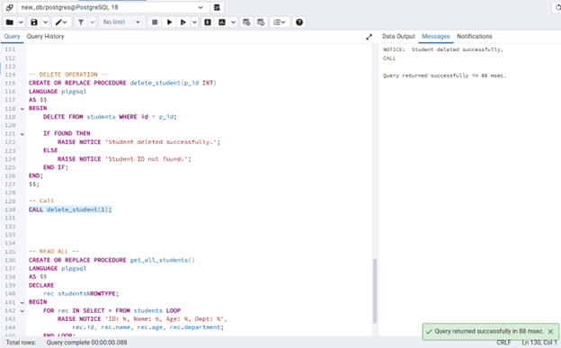

### Input e:
    ```sql
        -- READ ALL -- 
        CREATE OR REPLACE PROCEDURE get_all_students()
        LANGUAGE plpgsql
        AS $$
        DECLARE
            rec students%ROWTYPE;
        BEGIN
            FOR rec IN SELECT * FROM students LOOP
                RAISE NOTICE 'ID: %, Name: %, Age: %, Dept: %',
                    rec.id, rec.name, rec.age, rec.department;
            END LOOP;
        END;
        $$;

        -- Call
        CALL get_all_students();
    ```
Output e.1:
    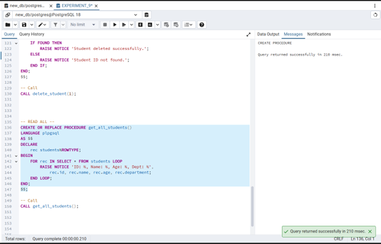
Output e.2:
    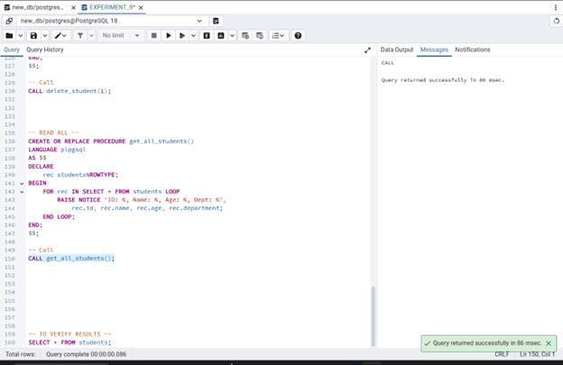
 
### Input f:
    ```sql
        -- TO VERIFY RESULTS --
        SELECT * FROM students;
        Output f
    ```
Output f:
    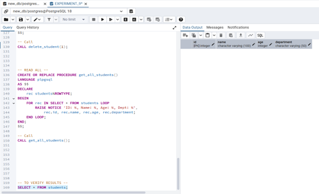

## Learning Outcomes
    •	Students gain strong understanding of procedural SQL, parameterized operations, and enterprise-level database logic, making them job-ready for backend and database roles. Exp 9:
    •	Creating and Implementing Packages in PL/SQL
    •	Students gain a strong understanding of procedural SQL and how stored procedures differ from plain SQL queries in terms of structure and execution. 
    •	Students are able to design and implement parameterized stored procedures for all four CRUD operations — Create, Read, Update, and Delete — on a PostgreSQL database. 
    •	Students develop the ability to use PL/pgSQL control structures such as IF, FOUND, and RAISE NOTICE to add conditional logic and feedback within database procedures. 
    •	Students understand how to call stored procedures using the CALL statement and verify outputs through SELECT queries and console notices. 
    •	Students gain practical exposure to enterprise-level database design patterns where business logic is encapsulated within the database layer rather than the application layer.
